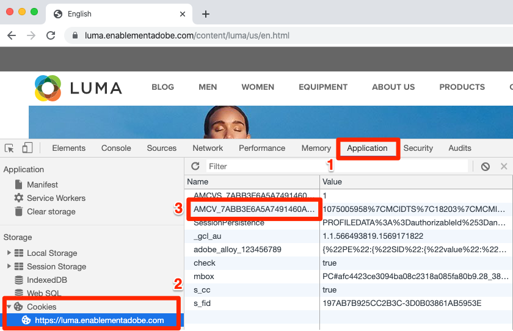
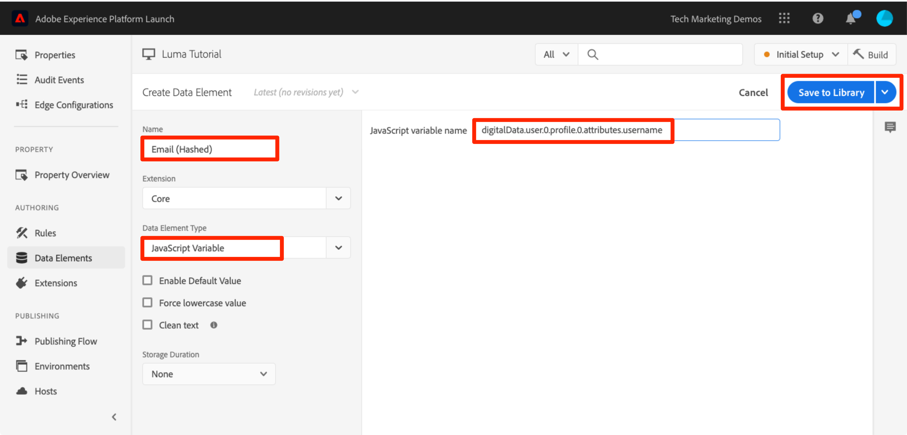
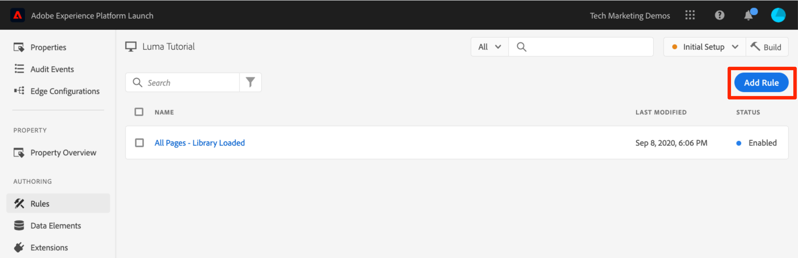

# 添加 Adobe Experience Platform Identity Service

本课程将指导您完成实施 [Adobe Experience Platform Identity Service 扩展](https://experienceleague.adobe.com/docs/experience-platform/tags/extensions/adobe/id-service/overview.html)以及发送客户 ID 所需的步骤。

[Adobe Experience Platform Identity Service](https://experienceleague.adobe.com/docs/id-service/using/home.html)在所有Adobe解决方案中设置了一个通用访客ID，以便增强Experience Cloud功能，如解决方案之间的受众共享。 您还可以将自己的客户 ID 发送到该服务，以启用跨设备定位以及与客户关系管理 (CRM) 系统的集成。

>[!NOTE]
>
>Adobe Experience Platform Launch正在作为一套数据收集技术集成到Adobe Experience Platform中。 在使用此内容时，您应该了解的界面中推出了几项术语更改：
>
> * platform launch（客户端）现在为&#x200B;**[[!DNL tags]](https://experienceleague.adobe.com/docs/experience-platform/tags/home.html)**
> * platform launch服务器端现在为&#x200B;**[[!DNL event forwarding]](https://experienceleague.adobe.com/docs/experience-platform/tags/event-forwarding/overview.html)**
> * Edge配置现在为&#x200B;**[[!DNL datastreams]](https://experienceleague.adobe.com/docs/experience-platform/edge/fundamentals/datastreams.html)**

## 学习目标

在本课程结束后，您将能够：

* 添加 Identity Service 扩展
* 创建数据元素以收集客户 ID
* 创建规则以使用“Set Customer IDs”操作将客户 ID 发送到 Adobe
* 使用规则排序功能对同一事件中触发的规则进行排序

## 先决条件

您应该已经完成[配置标记](create-a-property.md)部分中的课程。

## 添加 Identity Service 扩展

由于这是您添加的第一个扩展，这里先简要概述一下扩展。扩展是标记的核心功能之一。 扩展是由 Adobe、Adobe 合作伙伴或任何 Adobe 客户构建的集成，可为您部署到网站的标记添加无限数量的新选项。如果将标记看作一种操作系统，那么扩展就是您安装的应用程序，因此标记可以执行您所需的各种操作。

**添加 Identity Service 扩展**

1. 在左侧导航中，单击&#x200B;**[!UICONTROL 扩展]**

1. 单击&#x200B;**[!UICONTROL 目录]**&#x200B;以转到扩展目录页面

1. 查看 Catalog 中提供的各种扩展

1. 在顶部的筛选器中，键入“id”以筛选目录

1. 在Adobe Experience Platform Identity Service的卡片上，单击&#x200B;**[!UICONTROL 安装]**

   

1. 请注意，已自动为您检测 Experience Cloud 组织 ID。

1. 保留所有默认设置，然后单击&#x200B;**[!UICONTROL 保存到库并生成]**

   

>[!NOTE]
>
>Identity Service扩展的每个版本均附带一个特定版本的VisitorAPI.js，扩展描述中对其进行了说明。 您可以通过更新 Identity Service 扩展来更新 VisitorAPI.js 版本。

### 验证该扩展

Identity Service扩展是少数标记扩展之一，该扩展无需使用规则操作即可发出请求。 该扩展会在第一次访问网站并加载第一页时自动向 Identity Service 发出请求。请求获取 ID 后，该 ID 将存储在以“AMCV_”开头的第一方 Cookie 中。

**验证 Identity Service 扩展**

1. 打开 [Luma 网站](https://luma.enablementadobe.com/content/luma/us/en.html)

1. 如[前面的课程](switch-environments.md)中所述，确保Debugger将标记属性映射到&#x200B;*您的*&#x200B;开发环境。

1. 在Debugger的“摘要”选项卡上，标记部分应指示已实施Adobe Experience Platform Identity Service扩展。

1. 此外，在“摘要”选项卡上，Identity Service部分还应使用数据收集界面的扩展配置屏幕上显示的相同组织ID进行填充：

   

1. 用于检索访客 ID 的初始请求可能会显示在 Debugger 的 Identity Service 选项卡中。但是，由于可能已经发出该请求，因此如果您没有看到该请求，请不要担心。
   

1. 在发出获取访客 ID 的初始请求后，该 ID 会存储在名称以 `AMCV_` 开头的 Cookie 中。您可以通过执行以下操作确认已设置该 Cookie：
   1. 打开浏览器的开发人员工具
   1. 转到 `Application` 选项卡
   1. 展开左侧的 `Cookies`
   1. 单击域 `https://luma.enablementadobe.com`
   1. 在右侧查找 AMCV_ Cookie。您可能会看到自那时以来已使用硬编码标记属性以及您自己的属性加载Luma网站的多个。
      

操作完成！您已添加第一个扩展！有关 Identity Service 配置选项的更多详细信息，请参阅[此文档](https://experienceleague.adobe.com/docs/id-service/using/id-service-api/configurations/function-vars.html)。

## 发送客户 ID

接下来，您将向 Identity Service 发送[客户 ID](https://experienceleague.adobe.com/docs/id-service/using/reference/authenticated-state.html)。这样您就能够[集成 CRM](https://experienceleague.adobe.com/docs/core-services/interface/customer-attributes/attributes.html) 与 Experience Cloud，并跨多个设备跟踪访客。

在之前的[添加数据元素、规则和库](add-data-elements-rules.md)课程中，您已创建一个数据元素并将其用在规则中。现在，您将使用这些相同的技术在访客进行身份验证后发送客户 ID。

### 为客户 ID 创建数据元素

首先，创建两个数据元素：

1. `Authentication State` — 捕获访客是否已登录
1. `Email (Hashed)` — 从数据层捕获电子邮件地址（用作客户 ID）的哈希版本

**为身份验证状态创建数据元素**

1. 在左侧导航中单击&#x200B;**[!UICONTROL 数据元素]**
1. 单击&#x200B;**[!UICONTROL 添加数据元素]**&#x200B;按钮

   

1. 将数据元素命名为 `Authentication State`
1. 对于&#x200B;**[!UICONTROL 数据元素类型]**，请选择&#x200B;**[!UICONTROL 自定义代码]**
1. 单击&#x200B;**[!UICONTROL 打开编辑器]**&#x200B;按钮

   

1. 在 [!UICONTROL Edit Code] 窗口中，使用以下代码根据 Luma 网站数据层中的属性返回“logged in”或“logged out”值：

   ```javascript
   if (digitalData.user[0].profile[0].attributes.loggedIn)
       return "logged in"
   else
       return "logged out"
   ```

1. 单击&#x200B;**[!UICONTROL 保存]**&#x200B;以保存自定义代码

   

1. 将所有其他设置保留为其默认值
1. 单击&#x200B;**[!UICONTROL 保存到库]**&#x200B;以保存数据元素并返回到数据元素页面。 在做出所有更改并准备好验证之前，我们不需要执行“生成”。

   

通过了解用户的身份验证状态，您可以知道客户 ID 应何时存在于页面上以发送到 Identity Service。下一步是为客户 ID 本身创建一个数据元素。在 Luma 演示网站上，您将使用访客电子邮件地址的哈希版本。

**为经过哈希处理的电子邮件添加数据元素**

1. 单击&#x200B;**[!UICONTROL 添加数据元素]**&#x200B;按钮

   

1. 将数据元素命名为 `Email (Hashed)`
1. 对于&#x200B;**[!UICONTROL 数据元素类型]**，请选择&#x200B;**[!UICONTROL JavaScript变量]**
1. 作为&#x200B;**[!UICONTROL JavaScript变量名称]**，使用以下指向Luma网站数据层中变量的指针： `digitalData.user.0.profile.0.attributes.username`
1. 将所有其他设置保留为其默认值
1. 单击&#x200B;**[!UICONTROL 保存到库]**&#x200B;以保存数据元素

   

### 添加用于发送客户 ID 的规则

Adobe Experience Platform Identity Service 使用名为“Set Customer IDs”的操作，在规则中传递客户 ID。现在，您将创建一个规则，以在访客进行身份验证后触发此操作：

**创建用于发送客户 ID 的规则**

1. 在左侧导航中，单击&#x200B;**[!UICONTROL 规则]**
1. 单击&#x200B;**[!UICONTROL 添加规则]**&#x200B;以打开规则生成器

   

1. 将规则命名为 `All Pages - Library Loaded - Authenticated - 10`

   >[!TIP]
   >
   >此命名约定表示，您将在用户进行身份验证后，在所有页面的顶部触发此规则，并且此规则的顺序为“10”。 使用此类命名约定（而不是针对操作中触发的解决方案进行命名），可以最大限度地减少实施所需的规则总数。

1. 在&#x200B;**[!UICONTROL 事件]**&#x200B;下，单击&#x200B;**[!UICONTROL 添加]**

   

   1. 对于&#x200B;**[!UICONTROL 事件类型]**，选择&#x200B;**[!UICONTROL 已加载的库（页面顶部）]**
   1. 展开&#x200B;**[!UICONTROL 高级选项]**&#x200B;部分，对于&#x200B;**[!UICONTROL 订单]**，输入`10`。 顺序控制由同一事件触发的规则序列。顺序靠前的规则会在顺序靠后的规则之前触发。在此例中，您需要先设置客户 ID，然后再触发 Target 请求，您将在下一课程中使用顺序为 `50` 的规则来实现此操作。
   1. 单击&#x200B;**[!UICONTROL Keep Changes]**&#x200B;按钮以返回规则生成器

   

1. 在&#x200B;**[!UICONTROL 条件]**&#x200B;下，单击&#x200B;**[!UICONTROL 添加]**

   

   1. 对于&#x200B;**[!UICONTROL 条件类型]**，选择&#x200B;**[!UICONTROL 值比较]**
   1. 单击  图标以打开数据元素模式窗口。

      

   1. 在数据元素模式窗口中，单击&#x200B;**[!UICONTROL 身份验证状态]**，然后单击&#x200B;**[!UICONTROL 选择]**

      

1. 确保运算符为 `Equals`
1. 在文本字段中键入“logged in”，这会导致规则在数据元素“Authentication State”具有“logged in”值时触发。

1. 单击&#x200B;**[!UICONTROL 保留更改]**

   

1. 在&#x200B;**[!UICONTROL 操作]**&#x200B;下，单击&#x200B;**[!UICONTROL 添加]**

   

   1. 对于&#x200B;**[!UICONTROL 扩展]**，选择&#x200B;**[!UICONTROL Experience CloudID服务]**
   1. 对于&#x200B;**[!UICONTROL 操作类型]**，选择&#x200B;**[!UICONTROL 设置客户ID]**
   1. 对于&#x200B;**[!UICONTROL 集成代码]**，输入`crm_id`
   1. 对于&#x200B;**[!UICONTROL Value]**，打开数据元素选择器模式并选择`Email (Hashed)`
   1. 对于&#x200B;**[!UICONTROL 身份验证状态]**，选择&#x200B;**[!UICONTROL 已验证]**
   1. 单击&#x200B;**[!UICONTROL Keep Changes]**&#x200B;按钮以保存操作并返回规则生成器

      

1. 单击&#x200B;**[!UICONTROL 保存到库并生成]**&#x200B;按钮以保存规则

   

现在，您已创建规则，在访客进行身份验证后，此规则会将客户 ID 作为 `crm_id` 变量发送。由于您将顺序指定为 `10`，此规则将在 `All Pages - Library Loaded` 规则（您在[添加数据元素、规则和库](add-data-elements-rules.md)课程中创建，使用默认顺序值 `50`）之前触发。

### 验证客户 ID

为验证您的工作，您将登录 Luma 网站以确认新规则的行为。

**登录 Luma 网站**

1. 打开 [Luma 网站](https://luma.enablementadobe.com/content/luma/us/en.html)

1. 如[前面的课程](switch-environments.md)中所述，确保Debugger将标记属性映射到&#x200B;*您的*&#x200B;开发环境

   

1. 单击Luma网站右上角的&#x200B;**[!UICONTROL LOGIN]**&#x200B;链接

   

1. 输入 `test@adobe.com` 作为用户名
1. 输入 `test` 作为密码
1. 单击&#x200B;**[!UICONTROL 登录]**&#x200B;按钮

   

1. 返回主页

现在，使用 Debugger 扩展确认已将客户 ID 发送到该服务。

**验证 Identity Service 是否传递了客户 ID**

1. 确保焦点位于显示 Luma 网站的标签页中
1. 在 Debugger 中，转到 Adobe Experience Platform Identity Service 选项卡
1. 展开您的组织 ID
1. 单击具有 `Customer ID - crm_id` 值的单元格
1. 在该模式窗口中，请注意客户 ID 值，以及反映的状态是 `AUTHENTICATED`：

   

1. 请注意，您可以通过查看 Luma 页面的源代码并查看 username 属性，确认经过哈希处理的电子邮件值。它应该与您在 Debugger 中看到的值相匹配：

   

### 其他验证提示

标记还具有丰富的控制台日志记录功能。 要开启这些功能，请转到Debugger中的&#x200B;**[!UICONTROL 工具]**&#x200B;选项卡，然后打开&#x200B;**[!UICONTROL 标记控制台日志记录]**&#x200B;切换开关。


此操作会同时在浏览器控制台和 Debugger 的“日志”选项卡中开启控制台日志记录功能。您应该会看到迄今为止已创建的所有规则的日志记录！请注意，新的日志条目会添加到列表的顶部，因此您的规则“All Pages - Library Loaded - Authenticated - 10”应在“All Pages - Library Loaded”规则之前触发，而在 Debugger 的控制台日志记录中会显示在该规则下方：


[下一课程“添加Adobe Target”>](target.md)
