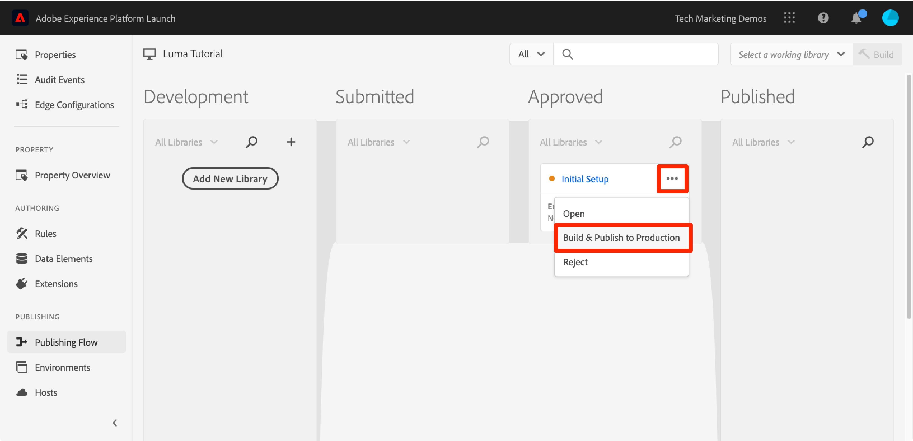
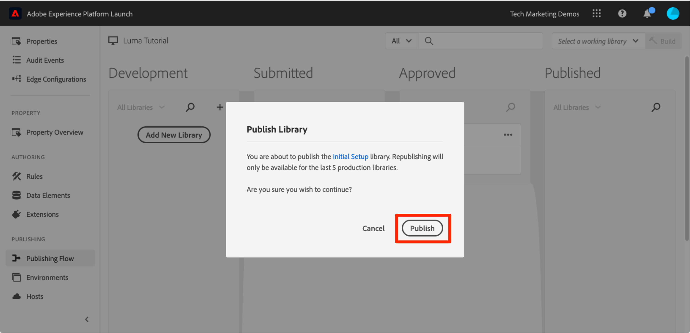

# 发布您的标记属性

现在，您已在开发环境中实施 Adobe Experience Cloud 的一些关键解决方案，接下来该学习发布工作流程。

>[!WARNING]
>
> 本教程中使用的Luma网站预计将在2026年2月16日这一周内被替换。 作为本教程的一部分完成的工作可能不适用于新网站。

>[!NOTE]
>
>Adobe Experience Platform Launch正在作为一套数据收集技术集成到Adobe Experience Platform中。 在使用此内容时，您应该了解的界面中推出了几项术语更改：
>
> * Platform Launch（客户端）现在为&#x200B;**[[!DNL tags]](https://experienceleague.adobe.com/docs/experience-platform/tags/home.html?lang=zh-Hans)**
> * Platform Launch服务器端现在为&#x200B;**[[!DNL event forwarding]](https://experienceleague.adobe.com/docs/experience-platform/tags/event-forwarding/overview.html?lang=zh-Hans)**
> * Edge配置现在为&#x200B;**[[!DNL datastreams]](https://experienceleague.adobe.com/docs/experience-platform/edge/fundamentals/datastreams.html?lang=zh-Hans)**

## 学习目标

在本课程结束后，您将能够：

1. 将开发库发布到暂存环境
1. 使用调试器将暂存库映射到生产网站
1. 将暂存库发布到生产环境

## 发布到暂存环境

现在，您已在开发环境中创建并验证库，接下来该将其发布到暂存环境。

1. 转到&#x200B;**[!UICONTROL 发布流]**&#x200B;页面

1. 打开库旁边的下拉菜单，然后选择&#x200B;**[!UICONTROL 提交以供审批]**

   

1. 单击对话框中的&#x200B;**[!UICONTROL Submit]**&#x200B;按钮：

   

1. 此时库将以未构建状态显示在 [!UICONTROL Submitted] 列中：

1. 打开下拉列表，然后选择&#x200B;**[!UICONTROL Build for Staging]**：

   

1. 出现绿色圆点图标后，便可以在暂存环境中预览库。

在真实情景中，该过程的下一步通常是让您的 QA 团队验证暂存库中所做的更改。他们可以使用调试器执行此操作。

**验证暂存库中所做的更改**

1. 在标记属性中，打开[!UICONTROL 环境]页面

1. 在 [!UICONTROL Staging] 行中，单击安装图标  以打开模式窗口

   

1. 单击复制图标  以将嵌入代码复制到剪贴板

1. 单击&#x200B;**[!UICONTROL 关闭]**&#x200B;以关闭该模式窗口

   

1. 在您的 Chrome 浏览器中打开 [Luma 演示网站](https://luma.enablementadobe.com/content/luma/us/en.html)

1. 通过单击[Debugger图标](https://chromewebstore.google.com/detail/adobe-experience-platform/bfnnokhpnncpkdmbokanobigaccjkpob)图标打开

   

1. 转到“工具”选项卡

1. 在&#x200B;**[!UICONTROL Adobe Launch >替换Launch嵌入代码]**&#x200B;部分中，粘贴剪贴板中的暂存嵌入代码
1. 打开&#x200B;**[!UICONTROL Apply across luma.enablementadobe.com]**&#x200B;开关

1. 单击磁盘图标以进行保存

   Debugger标记环境

1. 重新加载并查看调试器的“概要”选项卡。在Launch部分下，您现在应该看到已实施暂存资产，并显示资产名称（例如，“tags Tutorial”或您命名的任何资产名称）！

   Debugger标记环境

在实际工作中，当您的 QA 团队通过审核暂存环境中的更改进行签核后，便可以将其发布到生产环境。

## 发布到生产环境

1. 转到 [!UICONTROL Publishing] 页面

1. 从下拉列表中，单击&#x200B;**[!UICONTROL 批准发布]**：

   

1. 单击对话框中的&#x200B;**[!UICONTROL 批准]**&#x200B;按钮：

   

1. 此时库将以未构建状态（黄色圆点）显示在 [!UICONTROL Approved] 列中：

1. 打开下拉列表，然后选择&#x200B;**[!UICONTROL 生成并发布到生产环境]**：

   

1. 单击对话框中的&#x200B;**[!UICONTROL 发布]**：

   

1. 此时库将显示在 [!UICONTROL Published] 列中：

   

操作完成！您已完成本教程并在标记中发布了您的第一个资产！
