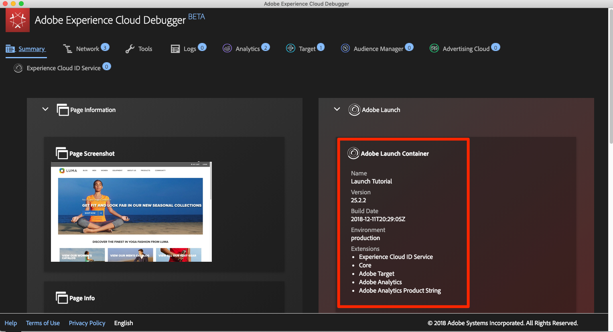

# 使用Experience Cloud Debugger切换标记环境

在本课程中，您将使用 [Adobe Experience Cloud Debugger扩展](https://chrome.google.com/webstore/detail/adobe-experience-cloud-de/ocdmogmohccmeicdhlhhgepeaijenapj) 替换 [Luma演示网站](https://luma.enablementadobe.com/content/luma/us/en.html) 拥有您自己的资产。

此技术称为环境切换，当您稍后在自己的网站上使用标记时，此技术将非常有用。 您将能够在浏览器中加载生产网站，但使用 *开发* 标记环境。 这使您能够放心地做出并验证标记更改，而不依赖于常规代码发布。  毕竟，这种将营销标记发布与常规代码发布分离的做法是客户最初使用标记的主要原因之一！

>[!NOTE]
>
>Adobe Experience Platform Launch将作为一套数据收集技术集成到Adobe Experience Platform中。 界面中已推出一些术语更改，在使用此内容时，您应该注意这些更改：
>
> * platform launch（客户端）现在为 **[[!DNL tags]](https://experienceleague.adobe.com/docs/experience-platform/tags/home.html?lang=zh-Hans)**
> * platform launch服务器端现在为 **[[!DNL event forwarding]](https://experienceleague.adobe.com/docs/experience-platform/tags/event-forwarding/overview.html)**
> * 现在已提供边缘配置 **[[!DNL datastreams]](https://experienceleague.adobe.com/docs/experience-platform/edge/fundamentals/datastreams.html)**

## 学习目标

在本课程结束后，您将能够：

* 使用Debugger加载替代标记环境
* 使用Debugger验证是否已加载替代标记环境

## 获取开发环境的 URL

1. 在标记资产中，打开 `Environments` 页面

1. 在 **[!UICONTROL Development]** 行中，单击安装图标  以打开模式窗口

1. 单击复制图标  以将嵌入代码复制到剪贴板

1. 单击 **[!UICONTROL Close]** 以关闭该模式窗口

   

## 替换Luma演示网站上的标记URL

1. 在您的 Chrome 浏览器中打开 [Luma 演示网站](https://luma.enablementadobe.com/content/luma/us/en.html)

1. 单击  图标，以打开 [Experience Cloud Debugger 扩展](https://chrome.google.com/webstore/detail/adobe-experience-cloud-de/ocdmogmohccmeicdhlhhgepeaijenapj)

   

1. 请注意，当前实施的标记属性将显示在“摘要”选项卡中

   

1. 转到“工具”选项卡
1. 滚动到&#x200B;**[!UICONTROL 替换 Launch 嵌入代码]**&#x200B;部分
1. 确保Debugger后面重点显示Luma网站的Chrome选项卡（不是本教程的选项卡，也不是数据收集界面的选项卡）。  将剪贴板中的嵌入代码粘贴到输入字段中
1. 打开“在luma.enablementadobe.com中应用”功能，以便Luma网站上的所有页面都将映射到您的标记属性
1. 单击 **[!UICONTROL Save]** 按钮

   

1. 重新加载 Luma 网站并检查 Debugger 的“摘要”选项卡。在 Launch 部分下，现在您应会看到开发资产正在使用中。请确认该资产的名称与您的资产名称匹配，并且环境显示为“development”。

   

>[!NOTE]
>
>每当您返回Luma网站时，Debugger将保存此配置并替换标记嵌入代码。 这不会影响您在其他打开的标签页中访问的其他网站。要阻止 Debugger 替换嵌入代码，请在 Debugger 的“工具”选项卡中单击嵌入代码旁边的&#x200B;**[!UICONTROL 删除]**&#x200B;按钮。

在继续本教程时，您将使用此技术将Luma网站映射到您自己的标记属性，以验证标记实施。 当您开始在生产网站上使用标记时，可以使用此相同技术来验证更改。

[下一课程“添加 Adobe Experience Platform Identity Service”>](id-service.md)
