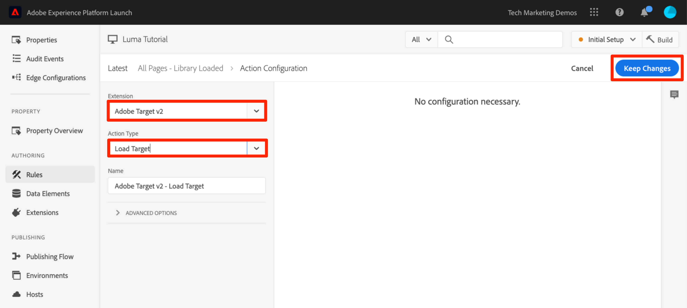
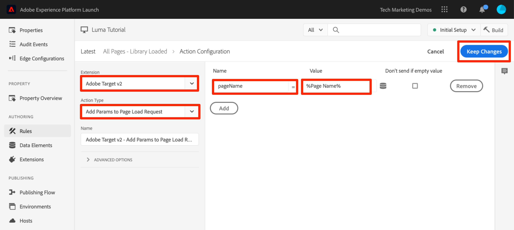
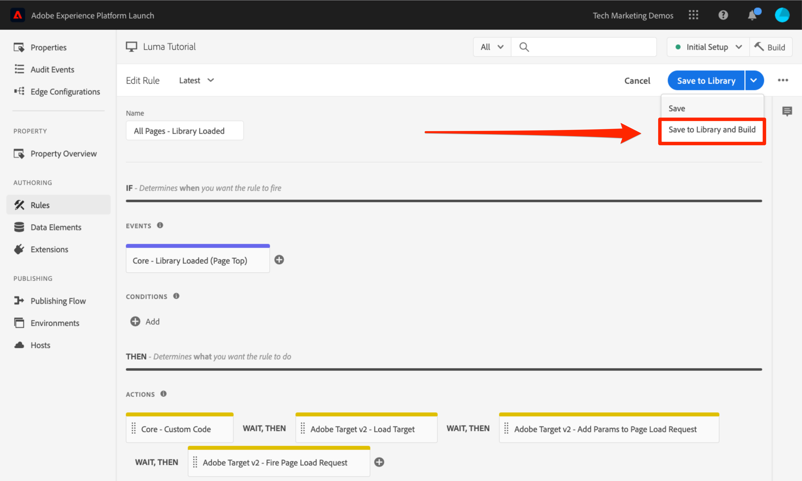

# 添加 Adobe Target

在本课程中，我们将通过页面加载请求和自定义参数来实施 [Adobe Target 扩展](https://experienceleague.adobe.com/docs/experience-platform/tags/extensions/adobe/target/overview.html)。

[Adobe Target](https://experienceleague.adobe.com/docs/target/using/target-home.html) 是一种 Adobe Experience Cloud 解决方案，可为您提供定制和个性化客户体验所需的一切功能，从而最大限度地增加您的 Web 和移动设备网站、应用程序、社交媒体及其他数字渠道的收入。

>[!NOTE]
>
>Adobe Experience Platform Launch正在作为一套数据收集技术集成到Adobe Experience Platform中。 在使用此内容时，您应该了解的界面中推出了几项术语更改：
>
> * platform launch（客户端）现在为 **[!DNL tags]**
> * platform launch服务器端现在为 **[!DNL event forwarding]**
> * Edge配置现在为 **[!DNL datastreams]**

## 学习目标

在本课程结束后，您将能够：

* 添加预隐藏代码片段，以用于管理在将Target与异步标记嵌入代码结合使用时出现的闪烁情况
* 添加 Target v2 扩展
* 触发页面加载请求（以前称为“全局 mbox”）
* 向页面加载请求添加参数
* 说明如何将配置文件和实体参数添加到页面加载请求
* 通过所需参数触发订单确认请求
* 说明如何添加高级配置，如库页眉和库页脚代码
* 验证 Target 实施

## 先决条件

要完成此部分中的课程，您必须先完成以下部分中的课程： [配置标记](create-a-property.md) 和 [添加Id服务](id-service.md).

## 添加 Target 预隐藏代码片段

在开始之前，我们需要对标记嵌入代码稍微做些更新。 异步加载标记嵌入代码时，页面可能会在Target库完全加载并执行内容交换之前完成渲染。 这可能会导致所谓的“闪烁”，在这种情况下，会先短暂显示默认内容，然后再将该内容替换为 Target 指定的个性化内容。如果要避免出现这种闪烁情况，我们强烈建议在紧靠标记异步嵌入代码之前的位置对特殊的预隐藏代码片段进行硬编码。

该硬编码操作已在 Luma 网站上完成，但我们将继续在示例页面上执行此操作，以便您了解实施。复制以下代码行：

```html
<script>
   //prehiding snippet for Adobe Target with asynchronous tags deployment
   ;(function(win, doc, style, timeout) {
   var STYLE_ID = 'at-body-style';
   function getParent() {
      return doc.getElementsByTagName('head')[0];
   }
   function addStyle(parent, id, def) {
      if (!parent) {
      return;
      }
      var style = doc.createElement('style');
      style.id = id;
      style.innerHTML = def;
      parent.appendChild(style);
   }
   function removeStyle(parent, id) {
      if (!parent) {
      return;
      }
      var style = doc.getElementById(id);
      if (!style) {
      return;
      }
      parent.removeChild(style);
   }
   addStyle(getParent(), STYLE_ID, style);
   setTimeout(function() {
      removeStyle(getParent(), STYLE_ID);
   }, timeout);
   }(window, document, "body {opacity: 0 !important}", 3000));
</script>
```

打开示例页面，并将其粘贴到紧靠标签嵌入代码之前的位置，如下图所示（如果行号不同，不必担心）。 在此屏幕截图中，预隐藏代码片段已缩小：


重新加载示例页面。您将注意到该页面会隐藏 3 秒才显示。这种行为是暂时性的，在您部署 Target 后便会消失。这种预隐藏行为由预隐藏代码片段末尾的两个配置控制，虽然这两个配置可以自定义，但通常情况下最好保留默认设置：

* `body {opacity: 0 !important}` 指定在 Target 加载之前要用于预隐藏的 css 定义。默认情况下，将隐藏整个主体。例如，如果您拥有一个一致的 DOM 结构，该结构中包含一个封装导航下所有内容的易于识别的容器元素，而且您从不希望测试导航或对其进行个性化设置，则可以使用此设置限制仅对该容器元素进行预隐藏。
* `3000` 指定预隐藏的超时设置。默认情况下，如果 Target 未在 3 秒内加载，则会显示页面。这种情况应极其少见。

有关更多详细信息，以及如需了解如何获取未缩小的预隐藏代码片段，请参阅[使用异步部署的 Adobe Target 扩展](https://experienceleague.adobe.com/docs/experience-platform/tags/extensions/adobe/target/overview.html#adobe-target-extension-with-an-asynchronous-deployment)。

## 添加 Target 扩展

Adobe Target 扩展支持使用适用于新版 Web 的 Target JavaScript SDK at.js 进行客户端实施。仍在使用Target旧版库mbox.js的客户， [应升级到at.js 2.x](https://experienceleague.adobe.com/docs/target/using/implement-target/client-side/mbox-implement/migrate-mbox/target-atjs-implementation.html) 以便使用标记。

Target v2 扩展包含两个主要部分：

1. 扩展配置，用于管理核心库设置
1. 规则操作，用于执行以下操作：
   1. 加载 Target (at.js 2.x)
   1. 向页面加载请求添加参数
   1. 向所有请求添加参数
   1. 触发页面加载请求

在第一个练习中，我们将添加扩展并查看配置。在稍后的练习中，我们将使用这些操作。

**添加扩展**

1. 转到 **[!UICONTROL Extensions > Catalog]**
1. 在筛选器中键入 `target` 以快速找到 Adobe Target 扩展。共有两个扩展 - Adobe Target 和 Adobe Target v2。本教程将使用 v2 版扩展，该扩展使用最新版 at.js（当前为 2.x），该版本既适用于传统网站，也适用于单页面应用程序 (SPA)。
1. 单击 **[!UICONTROL Install]**

   

1. 添加扩展时，它将从 Target 界面中导入许多（但并不是所有）at.js 设置，如下图所示。其中有一项设置不会导入，那就是 Timeout，此设置在添加该扩展后始终为 3000 毫秒。在本教程中，请保留默认设置。请注意，左侧将显示扩展的当前版本附带的 at.js 版本。

1. 单击 **[!UICONTROL Save to Library]**

   

此时，Target 还未真正执行任何操作，因此没有任何要验证的项目。

>[!NOTE]
>
> Target 扩展的每个版本均附带一个特定版本的 at.js，扩展描述中列出了该 at.js 版本。您可以通过更新 Target 扩展来更新 at.js 版本。

## 加载 Target 并触发页面加载请求

营销人员在测试和定位内容时可使用 Target 来控制访客在页面上的体验。鉴于 Target 在页面显示中发挥的这一重要作用，应尽早加载 Target 以最大限度地减少对页面可见性的影响。在此部分中，我们将加载 Target JavaScript 库 - at.js，并触发页面加载请求（在 at.js 的早期版本中称为“全局 mbox”）。

您可以使用在“[添加数据元素、规则和库](add-data-elements-rules.md)”课程中创建的 `All Pages - Library Loaded` 规则来实施 Target，因为它已在页面加载时尽早触发。

**加载 Target**

1. 转到 **[!UICONTROL 规则]** ，然后单击 `All Pages - Library Loaded` 以打开规则编辑器

   

1. 在 Actions 下，单击  以添加新操作

   

1. 选择 **[!UICONTROL Extension > Adobe Target v2]**

1. 选择 **[!UICONTROL Action Type > Load Target]**

1. 单击 **[!UICONTROL Keep Changes]**

   

添加 `Load Target` 操作后，页面上将会加载 at.js。但是，在添加 `Fire Page Load Request` 操作之前，不会触发任何 Target 请求。

**触发页面加载请求**

1. 在 Actions 下，再次单击  以添加其他操作

   

1. 选择 **[!UICONTROL Extension > Adobe Target v2]**

1. 选择 **[!UICONTROL Action Type > Fire Page Load Request]**

1. 页面加载请求有一些配置，这些配置涉及是否隐藏页面以及用于预隐藏的 CSS 选择器。这些设置可与页面上硬编码的预隐藏代码片段结合使用。保留默认设置。

1. 单击 **[!UICONTROL Keep Changes]**

   

1. 新操作将在 `Load Target` 操作后依次添加，这些操作将按此顺序执行。您可以拖放操作以重新排列顺序，但在此场景中，`Load Target` 需要先于 `Fire Page Load Request` 执行。

1. 单击 **[!UICONTROL Save to Library and Build]**

   

### 验证页面加载请求

现在，您已添加Target v2扩展并触发 `Load Target` 和 `Fire Page Load Request` 操作，则应在使用标记属性的所有页面上发出页面加载请求。

**验证 Load Target 和 Fire Page Load Request 操作**

1. 重新加载示例页面。此时，页面应该不会再延迟 3 秒才显示。如果您使用 `file://` 协议加载示例页面，则应该在 Firefox 或 Safari 浏览器中执行此步骤，因为使用 `file://` 协议时，Chrome 不会触发 Target 请求。

1. 打开 [Luma 网站](https://luma.enablementadobe.com/content/luma/us/en.html)

1. 确保Debugger将标记属性映射到 *您的* 开发环境，如 [早先的教训](switch-environments.md)

   

1. 转到 Debugger 的“摘要”选项卡

1. 在 `Launch` 部分中，确认 `Target` 显示在 `Extensions` 标题下

1. 在 `Target` 部分中，确认显示您的 at.js 库版本

   

1. 最后，转到 `Target` 选项卡，展开您的客户端代码，并确认显示您的页面加载请求：

   

恭喜！您已实施 Target！

## 添加参数

通过在 Target 请求中传递参数，可以向您的定位、测试和个性化活动增添强大的功能。标记扩展提供了两个用于传递参数的操作：

1. `Add Params to Page Load Request`，可向页面加载请求添加参数（等效于 [targetPageParams()](https://experienceleague.adobe.com/docs/target/using/implement-target/client-side/functions-overview/cmp-atjs-functions.html) 方法）

1. `Add Params to All Requests`，可在所有 Target 请求中添加参数，例如页面加载请求以及从 Custom Code 操作发出或在您的网站上硬编码的其他请求（等效于 [targetPageParamsAll()](https://experienceleague.adobe.com/docs/target/using/implement-target/client-side/functions-overview/cmp-atjs-functions.html) 方法）

这两个操作可在 `Load Target` 操作“之前”**&#x200B;使用，并且可根据您的规则配置在不同的页面上设置不同的参数。使用通过 Identity Service 设置客户 ID 时所使用的规则排序功能，在触发页面加载请求的规则之前对 `Library Loaded` 事件设置其他参数。
>[!TIP]
>
> 由于大多数实施都使用页面加载请求进行活动交付，因此通常只使用 `Add Params to Page Load Requests` 操作便已足够。

### 请求 (mbox) 参数

参数用于将自定义数据传递到 Target，从而丰富您的个性化功能。参数适用于在浏览会话期间频繁更改且不会持久保留的属性，如页面名称、模板等。

让我们将之前在[添加数据元素、规则和库](add-data-elements-rules.md)课程中创建的 `Page Name` 数据元素添加为请求参数。

**添加请求参数**

1. 转到 **[!UICONTROL 规则]** ，然后单击 `All Pages - Library Loaded` 以打开规则编辑器。

   

1. 在 Actions 下，单击  以添加新操作

   

1. 选择 **[!UICONTROL Extension > Adobe Target v2]**

1. 选择 **[!UICONTROL Action Type > Add Params to Page Load Request]**

1. 输入 `pageName` 作为 **[!UICONTROL Name]**

1. 单击  以打开数据元素模式窗口

1. 单击 `Page Name` 数据元素

1. 单击 **[!UICONTROL Select]** 按钮

   

1. 单击 **[!UICONTROL Keep Changes]**

   

1. 单击并拖动 `Add Params to Page Load Request` 操作的左边缘，以重新排列该操作，使其位于 `Fire Page Load Request` 操作之前（可在 `Load Target` 之前或之后）

1. 单击 **[!UICONTROL Save to Library and Build]**

   

#### 验证请求参数

目前，随 at.js 2.x 请求一起传递的自定义参数在 Debugger 中不容易看到，因此我们将利用浏览器的开发人员工具。

**验证 pageName 请求参数**

1. 重新加载Luma网站，确保该网站已映射到您自己的标记属性
1. 打开浏览器的开发人员工具
1. 单击“网络”选项卡
1. 使用 `tt.omtrdc`（或 Target 请求的 CNAME&#39;d 域）筛选请求
1. 展开 `Headers` > `Request Payload` > `execute.pageLoad.parameters` 部分以验证 `pageName` 参数和值


<!--Now go to the **[!UICONTROL Target]** tab in the Debugger. Expand your client code and look at the requests. You should see the new `pageName` parameter passed in the request:

-->

### 配置文件参数

与请求参数类似，配置文件参数也通过 Target 请求进行传递。但是，配置文件参数存储在 Target 访客配置文件数据库中，并在[访客配置文件留存期](https://experienceleague.adobe.com/docs/target/using/audiences/visitor-profiles/visitor-profile-lifetime.html)内持久保留。您可以在网站的一个页面上设置配置文件参数，然后将其用于另一页面上的 Targe 活动。以下是一个汽车网站的示例。当访客访问某个车辆页面时，您可以传递配置文件参数“profile.lastViewed=sportscar”，以记录访客对该特定车辆感兴趣。当访客浏览至其他非车辆页面时，您可以根据访客最近查看的车辆定位内容。配置文件参数适用于很少更改或只在某些页面上可用的属性。

在本教程中，您将不会传递任何配置文件参数，但其工作流程与传递 `pageName` 参数时所执行的操作几乎相同。唯一的不同之处在于，您需要为配置文件参数名称指定 `profile.` 前缀。下面显示了 `Add Params to Page Load Request` 操作中名为“userType”的配置文件参数：


### 实体参数

实体参数是[实施推荐](https://experienceleague.adobe.com/docs/target/using/recommendations/plan-implement.html)时使用的特殊参数，主要有三个原因：

1. 用作触发产品推荐的键值。例如，当使用诸如“查看了产品 X 的人员还查看了 Y”之类的推荐算法时，“X”便是推荐的“键值”。它通常为访客当前正在查看的产品 SKU (`entity.id`) 或类别 (`entity.categoryId`)。
1. 用于收集访客行为以提供推荐算法，例如“最近查看的产品”或“查看次数最多的产品”
1. 用于填充 Recommendations 目录。Recommendations 中有一个数据库，其中包含您网站上的所有产品或文章，以便可在推荐选件中提供这些产品或文章。例如，推荐产品时，您通常希望显示诸如产品名称 (`entity.name`) 和图像 (`entity.thumbnailUrl`) 之类的属性。有些客户会使用后端信息源填充其目录，但这些目录也可以使用 Target 请求中的实体参数进行填充。

在本教程中，您无需传递任何实体参数，但其工作流程与之前传递时所执行的操作相同， `pageName` 请求参数 — 只需为该参数提供一个前缀为“entity”的名称。 并将其映射到相关数据元素。请注意，一些常见实体具有必须要使用的保留名称（例如，产品 SKU 必须使用 entity.id）。下面显示了在 `Add Params to Page Load Request` 操作中设置的实体参数：


### 添加客户 ID 参数

通过 Adobe Experience Platform Identity Service 收集客户 ID，可以使用 Adobe Experience Cloud 的[客户属性](https://experienceleague.adobe.com/docs/target/using/audiences/visitor-profiles/working-with-customer-attributes.html?lang=zh-Hans)功能轻松地将 CRM 数据导入 Target。它还支持[跨设备访客拼合](https://experienceleague.adobe.com/docs/target/using/integrate/experience-cloud-device-co-op.html)，当客户在笔记本电脑和移动设备之间切换时，可以保持一致的用户体验。

在触发页面加载请求之前，必须在 Identity Service 的 `Set Customer IDs` 操作中设置客户 ID。为此，请确保您能够在网站上执行以下操作：

* 必须在页面上先提供客户ID，然后再提供标记嵌入代码
* 必须安装 Adobe Experience Platform Identity Service
* 必须在发生“Library Loaded (Page Top)”事件时触发的规则中使用 `Set Customer IDs` 操作
* 在“Set Customer IDs”操作“之后”**&#x200B;触发的规则中使用 `Fire Page Load Request` 操作

在上一课程（[添加 Adobe Experience Platform Identity Service](id-service.md)）中，您创建了 `All Pages - Library Loaded - Authenticated - 10` 规则以触发“Set Customer ID”操作。由于此规则的 `Order` 设置为 `10`，因此客户 ID 会在页面加载请求从 `All Pages - Library Loaded` 规则（其 `Order` 设置为 `50`）触发之前进行设置。这样，您便已经为 Target 实施了客户 ID 收集！

#### 验证客户 ID

目前，随 at.js 2.x 请求一起传递的自定义参数在 Debugger 中不容易看到，因此我们将利用浏览器的开发人员工具。

**验证客户 ID**

1. 打开 [Luma 网站](https://luma.enablementadobe.com/content/luma/us/en.html)

1. 确保Debugger将标记属性映射到 *您的* 开发环境，如 [早先的教训](switch-environments.md)

   

1. 使用凭据 `test@adobe.com`/`test` 登录 Luma 网站
1. 返回 [Luma 主页](https://luma.enablementadobe.com/content/luma/us/en.html)

1. 打开浏览器的开发人员工具
1. 单击“网络”选项卡
1. 使用 `tt.omtrdc`（或 Target 请求的 CNAME&#39;d 域）筛选请求
1. 展开 `Headers` > `Request Payload` > `id.customerIds.0` 部分以验证客户 ID 设置和值：


<!--
1. Open the Debugger
1. Go to the Target tab
1. Expand your client code
1. You should see parameters in the latest Target request for `vst.crm_id.id` and `vst.crm_id.authState`. `vst.crm_id.id` should have a value of the hashed email address and `vst.crm_id.authState` should have a value of `1` to represent `authenticated`. Note that `crm_id` is the `Integration Code` you specified in the Identity Service configuration and must align with the key you use in your [Customer Attributes data file](https://experienceleague.adobe.com/docs/core-services/interface/customer-attributes/t-crs-usecase.html):


-->

>[!WARNING]
>
> Adobe Experience Platform Identity Service 允许您向服务发送多个 ID，但是，只有第一个 ID 会发送到 Target。

### 添加资产令牌参数

>[!NOTE]
>
> 对于 Target Premium 客户而言，这是一个可选练习。

资产令牌是一个与 Target Premium [企业用户权限](https://experienceleague.adobe.com/docs/target/using/administer/manage-users/enterprise/property-channel.html?lang=zh-Hans)功能一起使用的保留参数。资产令牌用于定义不同的数字资产，以便可以为 Experience Cloud 组织的不同成员分配每个资产的不同权限。例如，您可能希望一组用户能够在您的网站上设置 Target 活动，但不能在您的移动设备应用程序中设置。

Target属性与标记属性和Analytics报表包类似。 具有多个品牌、网站和营销团队的企业可能会为每个网站或移动设备应用程序使用不同的Target资产、标记资产和Analytics报表包。 标记资产通过其嵌入代码进行区分，Analytics报表包通过其报表包ID进行区分，而Target资产则通过其资产令牌参数进行区分。


必须通过使用标记的自定义代码操作实施资产令牌 `targetPageParams()` 函数。 如果您使用具有单个标记属性的不同at_property值实施多个网站，则可以通过数据元素管理at_property值。

如果您是 Target Premium 客户，并且希望在 Tutorial 资产中实施资产令牌，则可以选择完成下面的练习：

1. 在单独的选项卡中，打开 Target 用户界面

1. 转到 **[!UICONTROL 管理>属性]**

1. 标识要使用的资产，然后单击 **[!UICONTROL &lt;/>]** （或创建新资产）

1. 将相应的代码段复制到 `<script></script>` 到您的剪贴板

   

1. 在标记选项卡中，转到 **[!UICONTROL 规则]** ，然后单击 `All Pages - Library Loaded` 以打开规则编辑器。

   

1. 在 Actions 下，单击 `Core - Custom Code` 操作以打开 `Action Configuration`

   

1. 打开代码编辑器，然后从包含的Target界面粘贴代码 `targetPageParams()` 函数
1. 单击 **[!UICONTROL 保存]** 按钮

   

1. 查看 **[!UICONTROL 全局执行]** 框so `targetPageParams()` 在全局范围内声明
1. 单击 **[!UICONTROL Keep Changes]**

   

1. 单击 **[!UICONTROL Save to Library and Build]**
   

>[!WARNING]
>
>如果您尝试添加 `at_property` 参数通过 **[!UICONTROL 向页面加载请求添加参数]** 操作，参数将会填充在网络请求中，但Target的可视化体验编辑器(VEC)在加载页面时无法自动检测它。 始终填充 `at_property` 使用 `targetPageParams()` 函数。

#### 验证资产令牌

目前，随 at.js 2.x 请求一起传递的自定义参数在 Debugger 中不容易看到，因此我们将利用浏览器的开发人员工具。

**验证资产令牌参数**

1. 打开 [Luma 网站](https://luma.enablementadobe.com/content/luma/us/en.html)
1. 确保Debugger将标记属性映射到 *您的* 开发环境，如 [早先的教训](switch-environments.md)

   

1. 打开浏览器的开发人员工具
1. 单击“网络”选项卡
1. 使用 `tt.omtrdc`（或 Target 请求的 CNAME&#39;d 域）筛选请求
1. 展开 `Headers` > `Request Payload` > `property.token` 部分以验证值
   

<!--
1. Go to the `Target` tab
1. Expand your client code
1. You should see the parameter for "at_property" in every page load request request as you browse the site:

-->

## 添加自定义请求

### 添加订单确认请求

订单确认请求是一种特殊类型的请求，用于将订单详细信息发送到 Target。包含的三个特定请求参数（orderId、orderTotal 和 productPurchasedId）可以将常规 Target 请求转换为订单请求。除了报告收入之外，订单请求还会执行以下操作：

1. 删除意外重复提交的订单
1. 筛选极端订单（总值与平均值相差三个以上标准偏差的订单）
1. 在后台使用其他算法计算统计置信度
1. 创建一个包含各订单详细信息的特殊可下载审核报告

最佳做法是在所有订单漏斗中使用订单确认请求，即使在非零售网站上也是如此。 例如，潜在客户生成网站中的潜在客户漏斗通常会在末尾生成一个唯一的“潜在客户 ID”。这些网站应该实施订单请求，并对 orderTotal 使用一个静态值（例如“1”）。

如果客户在大多数报表中使用Analytics for Target (A4T)集成，并且使用的是不支持A4T的Automated Personalization活动，则他们可能还希望实施订单请求。 此外，订单请求是 Recommendations 实施中的一个关键元素，可根据购买行为提供适当的算法。有关A4T支持的最新信息，请参阅 [文档](https://experienceleague.adobe.com/docs/target/using/integrate/a4t/a4t.html?lang=en#section_F487896214BF4803AF78C552EF1669AA).

订单确认请求应通过只在订单确认页面上或仅在发生订单确认事件时触发的规则进行触发。通常，订单确认请求可以与设置 Adobe Analytics 购买事件的规则结合使用。订单确认请求必须使用核心扩展的 Custom Code 操作进行配置，并使用适当的数据元素来设置 orderId、orderTotal 和 productPurchasedId 参数。

让我们添加在 Luma 网站上触发订单确认请求所需的数据元素和规则。由于您已经创建了一些数据元素，因此下面的说明将会相应进行缩减。

**为订单 ID 创建数据元素**

1. 单击 **[!UICONTROL 数据元素]** 在左侧导航中
1. 单击 **[!UICONTROL Add Data Element]**
1. 将数据元素命名为 `Order Id`
1. 选择 **[!UICONTROL Data Element Type > JavaScript Variable]**
1. 使用 `digitalData.cart.orderId` 作为 `JavaScript variable name`
1. 查看 `Clean text` 选项
1. 单击 **[!UICONTROL Save to Library]**（在我们对订单确认请求做出所有更改之前不会构建库）

**为购物车金额创建数据元素**

1. 单击 **[!UICONTROL Add Data Element]**
1. 将数据元素命名为 `Cart Amount`
1. 选择 **[!UICONTROL Data Element Type > JavaScript Variable]**
1. 使用 `digitalData.cart.cartAmount` 作为 `JavaScript variable name`
1. 查看 `Clean text` 选项
1. 单击 **[!UICONTROL Save to Library]**

**为购物车 SKU (Target) 创建数据元素**

1. 单击 **[!UICONTROL Add Data Element]**
1. 将数据元素命名为 `Cart SKUs (Target)`
1. 选择 **[!UICONTROL Data Element Type > Custom Code]**
1. 对于 Target，SKU 必须是一个逗号分隔列表。此自定义代码会将数据层数组重新设置为适当的格式。在自定义代码编辑器中，粘贴以下内容：

   ```javascript
   var targetProdSkus="";
   for (var i=0; i<digitalData.cart.cartEntries.length; i++) {
     if(i>0) {
       targetProdSkus = targetProdSkus + ",";
     }
     targetProdSkus = targetProdSkus + digitalData.cart.cartEntries[i].sku;
   }
   return targetProdSkus;
   ```

1. 查看 `Force lowercase value` 选项
1. 查看 `Clean text` 选项
1. 单击 **[!UICONTROL Save to Library]**

现在，我们需要创建一个规则，以在订单确认页面上将这些数据元素作为参数触发订单确认请求。

**为订单确认页面创建规则**

1. 单击 **[!UICONTROL 规则]** 在左侧导航中
1. 单击 **[!UICONTROL Add Rule]**
1. 将规则命名为 `Order Confirmation Page - Library Loaded - 60`
1. 单击 **[!UICONTROL Events > Add]**
   1. 选择 **[!UICONTROL Event Type > Library Loaded (Page Top)]**
   1. 下 **[!UICONTROL 高级选项]**，更改 `Order` 到 `60` 这样它就会在 `Load Target` 操作(位于我们的 `All Pages - Library Loaded` 规则，其中 `Order` 设置为 `50`)
   1. 单击 **[!UICONTROL Keep Changes]**
1. 单击 **[!UICONTROL Conditions > Add]**
   1. 选择 **[!UICONTROL Condition Type > Path Without Query String]**
   1. 对于 `Path equals`，输入 `thank-you.html`
   1. 打开正则表达式选项，将逻辑由 `equals` 更改为 `contains`（可使用 `Test` 功能确认在 URL `https://luma.enablementadobe.com/content/luma/us/en/user/checkout/order/thank-you.html` 中是否将通过测试）

      

   1. 单击 **[!UICONTROL Keep Changes]**
1. 单击 **[!UICONTROL Actions > Add]**
   1. 选择 **[!UICONTROL Action Type > Custom Code]**
   1. 单击 **[!UICONTROL Open Editor]**
   1. 将以下代码粘贴到 `Edit Code` 模式窗口中

      ```javascript
      adobe.target.getOffer({
        "mbox": "orderConfirmPage",
        "params":{
           "orderId": _satellite.getVar('Order Id'),
           "orderTotal": _satellite.getVar('Cart Amount'),
          "productPurchasedId": _satellite.getVar('Cart SKUs (Target)')
        },
        "success": function(offer) {
          adobe.target.applyOffer({
            "mbox": "orderConfirmPage",
            "offer": offer
          });
        },
        "error": function(status, error) {
          console.log('Error', status, error);
        }
      });
      ```

   1. 单击 **[!UICONTROL Save]** 以保存自定义代码
   1. 单击 **[!UICONTROL Keep Changes]** 以保留操作
1. 单击 **[!UICONTROL Save to Library and Build]**

#### 验证订单确认请求

目前，随 at.js 2.x 请求一起传递的自定义参数在 Debugger 中不容易看到，因此我们将利用浏览器的开发人员工具。

1. 打开 [Luma 网站](https://luma.enablementadobe.com/content/luma/us/en.html)

1. 确保Debugger将标记属性映射到 *您的* 开发环境，如 [早先的教训](switch-environments.md)

   

1. 浏览网站并向购物车中添加一些产品
1. 继续操作直到进入结账流程
1. 在结账过程中，必填字段仅包括 `First Name` 和 `Last Name`

   

1. 在 Review Order 页面上，确保单击 `Place Order` 按钮
1. 打开浏览器的开发人员工具
1. 单击“网络”选项卡
1. 使用 `tt.omtrdc`（或 Target 请求的 CNAME&#39;d 域）筛选请求
1. 单击第二个请求
1. 展开 `Headers` > `Request Payload` > `execute.mboxes.0` 部分以验证请求名称和订单参数：


<!--
1. Look in the Debugger
1. Go to the Target tab
1. Expand your client code
1. You should see the `orderConfirmPage` request as the latest Target request with the orderId, orderTotal, and productPurchasedId parameters populated with the details of your order

   link to "orderConfirmPage request with required parameters": images/target-debugger-orderConfirmPage.png 
-->

### 自定义请求

在极少数情况下，您需要发出页面加载请求和订单确认请求以外的Target请求。 例如，有时您要用于个性化的重要数据未在页面上的标记嵌入代码之前定义，此数据可能会在页面底部进行硬编码，或从异步API请求返回。 此数据可以使用其他请求发送到Target，不过在页面可见的情况下使用此请求交付内容并不是最佳做法。 此数据可用于丰富访客配置文件以供日后使用（使用配置文件参数）或填充Recommendations目录。

在这些情况下，使用核心扩展中的 Custom Code 操作，以使用 [getOffer()](https://experienceleague.adobe.com/docs/target-dev/developer/client-side/at-js-implementation/functions-overview/adobe-target-getoffer.html)/[applyOffer()](https://experienceleague.adobe.com/docs/target-dev/developer/client-side/at-js-implementation/functions-overview/adobe-target-applyoffer.html) 和 [trackEvent()](https://experienceleague.adobe.com/docs/target-dev/developer/client-side/at-js-implementation/functions-overview/adobe-target-trackevent.html) 方法触发请求。这非常类似于在[订单确认请求](#order-confirmation-request)练习中所执行的操作，但使用的请求名称有所不同，而且不会使用特殊的订单参数。在通过自定义代码发起 Target 请求之前，务必先使用 **[!UICONTROL Load Target]** 操作。

## 库页眉和库页脚

Target 用户界面的“编辑 at.js”屏幕中有几处位置，可供您粘贴紧接 at.js 文件之前或之后执行的自定义 JavaScript。库页眉有时用于通过 [targetGlobalSettings()](https://experienceleague.adobe.com/docs/target/using/implement-target/client-side/functions-overview/targetgobalsettings.html) 函数覆盖 at.js 设置，或者使用[数据提供商](https://experienceleague.adobe.com/docs/target-learn/tutorials/integrations/use-data-providers-to-integrate-third-party-data.html)功能传递来自第三方的数据。库页脚有时用于添加 [at.js 自定义事件](https://experienceleague.adobe.com/docs/target-dev/developer/client-side/at-js-implementation/functions-overview/atjs-custom-events.html)侦听器。

要在标记中复制此功能，只需使用核心扩展中的Custom Code操作，并将该操作排在Load Target操作之前（库页眉）或之后（库页脚）。 可以在与 `Load Target` 操作相同的规则中执行上述操作（如下图所示），或者也可以在单独的规则中执行，但其中的事件或顺序设置需确保在包含 `Load Target` 的规则之前或之后可靠触发：


要进一步了解自定义页眉和页脚的用例，请参阅以下资源：

* [使用 dataProviders 将第三方数据集成到 Adobe Target 中](https://experienceleague.adobe.com/docs/target-learn/tutorials/integrations/use-data-providers-to-integrate-third-party-data.html)
* [实施 dataProviders 将第三方数据集成到 Adobe Target 中](https://experienceleague.adobe.com/docs/target-learn/tutorials/integrations/implement-data-providers-to-integrate-third-party-data.html)
* [将响应令牌和 at.js 自定义事件与 Adobe Target 结合使用](https://experienceleague.adobe.com/docs/target-learn/tutorials/integrations/use-response-tokens-and-atjs-custom-events.html)

[下一课程“添加 Adobe Analytics”>](analytics.md)
